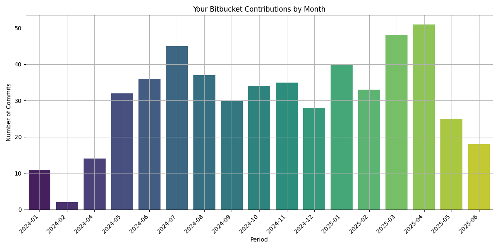

# Bitbucket Commit Visualizer

This tool fetches commit data from your Bitbucket repositories and visualizes your contributions over time using bar charts.



## Features

- Fetches all repositories in a given Bitbucket workspace
- Collects commits made by a specific user
- Visualizes commit activity by **month** or **week**
- Interactive matplotlib charts using seaborn

## Requirements

- Python 3.8+
- Bitbucket account with an [App Password](https://support.atlassian.com/bitbucket-cloud/docs/app-passwords/)
- Read access to your workspace and repositories

## Installation

```bash
git clone https://github.com/KelceyW/bitbucket-commit-visualizer.git
cd bitbucket-commit-visualizer
pip install -r requirements.txt
```

## Configuration

Create a .env file in the root directory with your bitbucket credentials

- BITBUCKET_USERNAME=your_bitbucket_username
- BITBUCKET_APP_PASSWORD=your_bitbucket_app_password
- BITBUCKET_WORKSPACE=your_workspace_id
- BITBUCKET_DISPLAY_NAME=Your Full Name (as shown in Bitbucket)


## Usage

```
python3 main.py
```

When prompted, choose how you'd like to view contributions:

- month (default)
- week 

